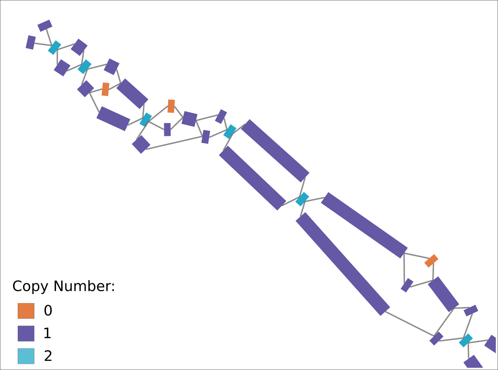
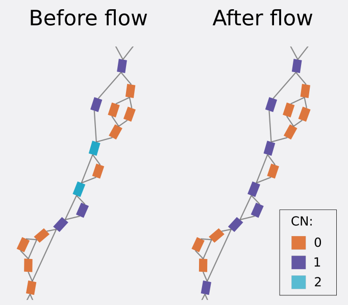
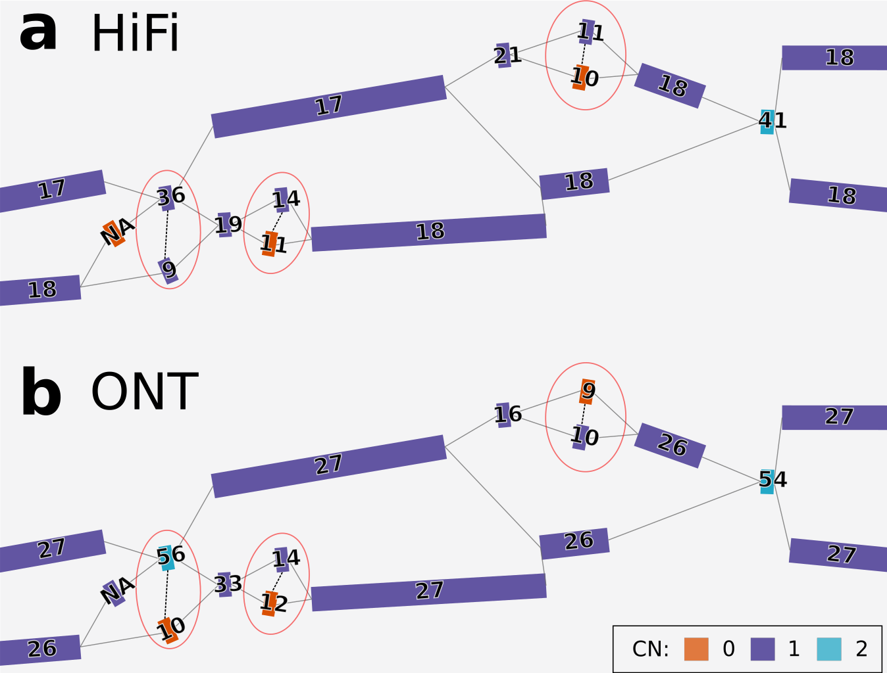

# Floco

Floco (_flow_+_copy_) is a tool to call individual node copy number (CN) on (pan)genome graphs, using sequence-to-graph alignment information.

## Table of contents

- [Installation](#installation)
  + [Requirements](#requirements)
  + [Bioconda](#bioconda)
  + [Docker/Singularity](#dockersingularity)
  + [Manual](#manual)
- [Usage](#usage)
  + [Input](#input)
  + [Output](#output)
  + [Command-line options](#command-line-options)
- [Test Dataset](#test-dataset)
- [Example applications](#example-applications)


## Installation

### Requirements

To run Floco, you need a [Gurobi License](https://www.gurobi.com/solutions/licensing/) for solving the ILP problem.

Additionally, you need:

- numpy>=2.3.2
- scikit-learn>=1.7.1
- scipy>=1.16.1
- gurobipy>=12.0.3

### Bioconda

Coming soon

### Docker/Singularity

Coming soon

### Manual

To manually install Floco, just run the following:

```bash
git clone https://github.com/hugocarmaga/floco.git
cd floco
pip install -e .
```

## Usage

### Input

To use Floco, you need two input files:
- GFA graph: file to have the CN estimated for. It **needs** to have **sequence** and to be **sorted** (i.e., all nodes must be before any edge line)
- GAF alignments: sequence-to-graph alignments to compute coverage and subsequent CN probabilities from. We recommend using [GraphAligner](https://github.com/maickrau/GraphAligner).

### Output

By default, Floco outputs one file, required argument `-o OUTPUT`, containg node name, length, sum of bp coverage across the node and the predicted CN value.

Additionally, when using the `--debug` option, Floco will produce further additional files:
- `stats_concordance-{filename}.csv`: File containing further statistics on nodes, namely the CN value with the highest probability before being fed into the network flow.
- `ilp_results-{filename}.csv`: File containing all ILP variables results.
- `model_{filename}.lp`: File containing the ILP model definition.
- `dump-{filename}.tmp.pkl`: pickle dump with all variables and parameters before ILP. It's especially helpful when running Floco multiple times on the same pair of GFA+GAF. It can then be given as an input parameter instead of the GAF file, resulting in Floco starting directly from the ILP solving.

### Command-line options

```bash
$ floco -h
usage: floco [-h] -g GRAPH [-a ALIGNMENT] -o OUTPUT [-p BG_PLOIDY [BG_PLOIDY ...]] [-S EXPEN_PEN] [-s CHEAP_PEN] [-e EPSILON] [-b BIN_SIZE] [-c COMPLEXITY] [-d PICKLE PICKLE]
             [--debug DEBUG]
options:
  -h, --help            show this help message and exit
  -g GRAPH, --graph GRAPH
                        The GFA file with the graph.
  -a ALIGNMENT, --alignment ALIGNMENT
                        The GAF file with sequence-to-graph alignments.
  -o OUTPUT, --output OUTPUT
                        The name for the output csv file with the copy numbers
  -p BG_PLOIDY [BG_PLOIDY ...], --bg-ploidy BG_PLOIDY [BG_PLOIDY ...]
                        Expected most common CN value in the graph (background ploidy of the dataset). (default:[1, 2])
  -S EXPEN_PEN, --expen-pen EXPEN_PEN
                        Probability for using the super edges when there are other edges available. (default:-10000)
  -s CHEAP_PEN, --cheap-pen CHEAP_PEN
                        Probability for using the super edges when there is no other edge available. (default:-25)
  -e EPSILON, --epsilon EPSILON
                        Epsilon value for adjusting CN0 counts to probabilities (default:0.02)
  -b BIN_SIZE, --bin-size BIN_SIZE
                        Set the bin size to use for the NB parameters estimation. (default:100)
  -c COMPLEXITY, --complexity COMPLEXITY
                        Model complexity (1-3): larger = slower and more accurate. (default: 2)
  -d PICKLE PICKLE, --pickle PICKLE PICKLE
                        Pickle dump with the data. Dump file can be produced with '--debug'.
  --debug DEBUG         Produce additional files.
```

## Test Dataset

The test dataset can be found [here](https://zenodo.org/records/17663150). It includes a graph for chromosome 6 from HG01114 and HiFi reads aligned to it with [GraphAligner](https://github.com/maickrau/GraphAligner).

To get copy number values for the test data, simply run:
```bash
floco -g HG01114-chr6.gfa.gz -a hifi_HG01114-chr6_ga.gaf.gz -o test_dataset_copy-numbers.csv
```

The output file should look like this:
```
Node,Length,Sum_coverage,Copy_number
utig4-9,11900559,210743696,3
utig4-99,111,666,1
utig4-98,138062,5047482,4
utig4-8,2333535,39779042,1
utig4-7,25009,856214,4
utig4-734,22256,636834,1
utig4-733,23057,358577,0
utig4-731,16975505,295336678,1
utig4-730,2829470,49583270,2
```

## Example applications

<p align="center"></p>

<p align="center"></p>

<p align="center"></p>